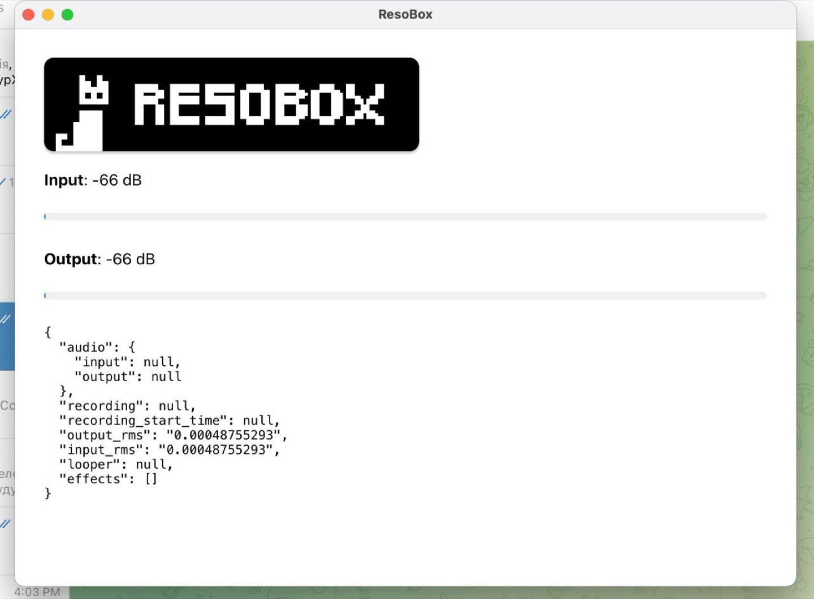
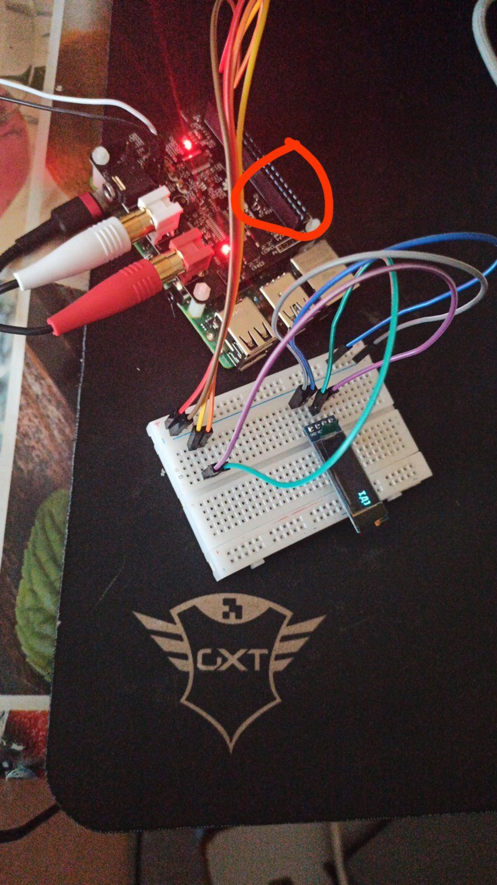

# ResoBox UI

**ResoBox UI** is the graphical interface designed for **ResoBox**, my custom-built pedalboard. It provides an intuitive platform for configuring and controlling the pedalboard's features.

  

  

---

## 🛠️ Features

- **User-Friendly Interface**: Simplified controls for managing pedalboard settings.
- **Real-Time Visualization**: Displays live signal and effect changes.
- **Customizable Layout**: Adapt the UI to match your workflow.
